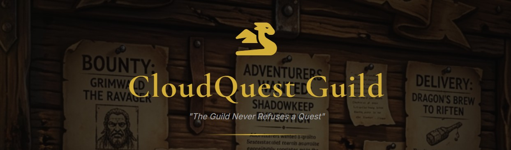
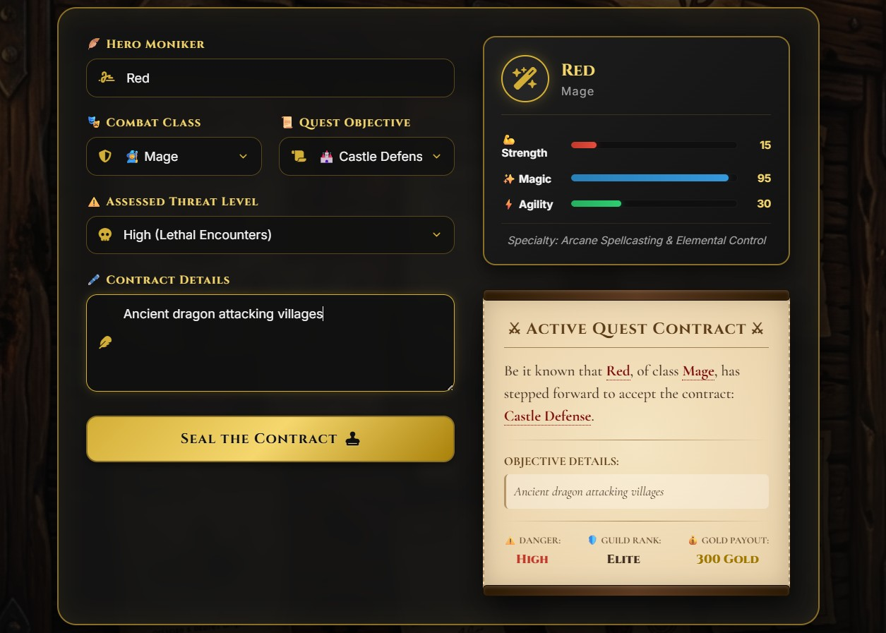
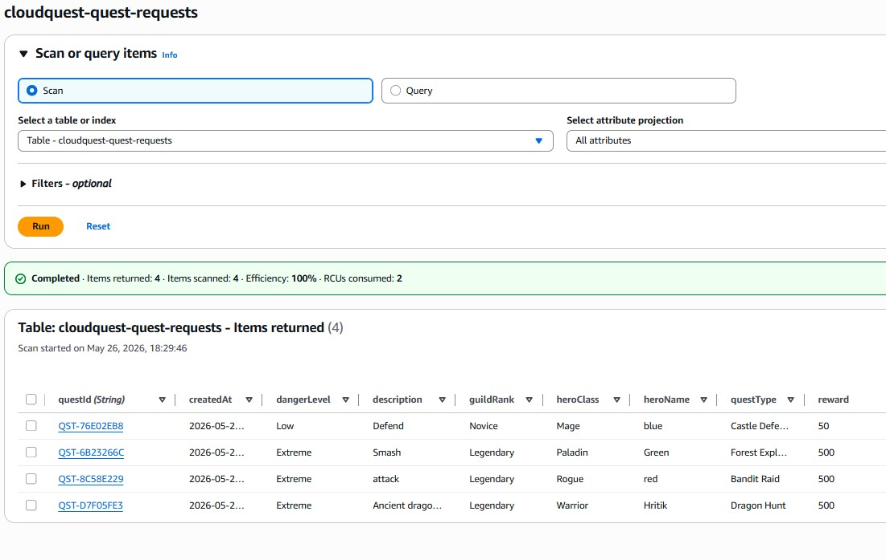

# ⚔ CloudQuest Guild Portal



**CloudQuest** is a premium, serverless fantasy-themed quest contract management platform built entirely on AWS. Aspiring adventurers can draft quest contracts, review dynamically calculated guild stats, submit contracts to the Guild, and view their confirmed parchment scrolls—all powered by a fast, event-driven serverless backend.


## 🎨 Premium RPG Game UI/UX Features

We have transformed this portal from a standard form into an immersive fantasy RPG interface:
- **Cinematic Visuals**: Dark fantasy aesthetics powered by Google Fonts (*Cinzel* and *Cormorant Garamond*), custom borders, and a custom background texture.
- **Dynamic Hero Stats Card**: An interactive stats card (💪 Strength, ✨ Magic, ⚡ Agility) that dynamically scales and animates depending on the selected **Combat Class** (Warrior, Mage, Archer, Paladin, Rogue).
- **Interactive Live Scroll**: A parchment-styled preview that synchronizes in real-time as the contract details, danger levels, and payouts are entered.
- **Web Audio API Synth Engine**: Play custom sound effects generated in the browser for UI interactions (soft ticks on hover, high-pitched selections on clicks, and epic fanfares on submission success).
- **Gold Coin Rain Particle System**: An interactive canvas-based animation that triggers a shower of gold coins upon contract approval.
- **Wax Seal Stamp Modal**: A realistic, animated SVG wax seal stamp that "slams" onto the final quest certificate.


## 📸 Portal Walkthrough

### 🏛 The Guild Hall (Main Portal)
Fill out your character details, select your combat class, choose your quest objectives, and review your live parchment preview:


### 📜 Active Quest Contract & Confirmed Seal
Upon submitting, watch the gold rain down and inspect your sealed quest contract:


### 🗄 Serverless Storage (DynamoDB)
Contracts are instantly processed by Lambda and persisted in the DynamoDB table:



## 🚀 Architecture Details

The system leverages a decoupled, 100% serverless infrastructure on AWS, provisioned entirely via Infrastructure as Code (Terraform):

```text
🧙 Adventurer (Browser) ──> Amazon S3 Static Website
        │
        └── (POST /submit-quest) ──> Amazon API Gateway (V2 HTTP API)
                                              │
                                              └──> AWS Lambda (Python Handler)
                                                        │
                                                        ├──> Write Logs to CloudWatch
                                                        └──> Save Contract to Amazon DynamoDB
```

For a comprehensive explanation of components, secure IAM policies, and system data flow diagrams, check the [Architecture Documentation](docs/architecture.md).


## 🛠 AWS Services Provisioned

| Service | Purpose |
| :--- | :--- |
| **AWS Lambda** | Stateless business logic (Python 3.x), calculations & data validation |
| **API Gateway** | Light, scalable HTTP endpoint with automated CORS mapping |
| **DynamoDB** | NoSQL single-table persistence tracking all quest metadata |
| **S3** | High-availability static website hosting for the RPG client |
| **IAM** | Least-privilege execution roles securing the Lambda microVM |
| **CloudWatch** | Integrated logs and metrics for system monitoring |


## 📂 Project Structure

```text
cloudquest-serverless/
├── docs/                      # Technical documentation & walkthrough assets
│   ├── screenshots/           # Portal image screenshots
│   ├── architecture.md        # Deep dive into data flow and security
│   └── deployment.md          # Comprehensive deployment steps
│
├── frontend/                  # Immersive RPG UI code
│   ├── index.html             # UI Layout and parchment modal
│   ├── style.css              # Custom styling, fonts, and keyframe animations
│   ├── app.js                 # Dynamic JS state, Synth audio, and coin physics
│   ├── config.js              # Dynamically updated backend endpoints
│   └── rpg_background.png     # Custom theme background asset
│
├── infra/                     # Infrastructure as Code (Terraform)
│   ├── provider.tf            # Provider configuration
│   ├── s3.tf                  # Frontend bucket and object deployment with etags
│   ├── dynamodb.tf            # Quest requests table definition
│   ├── lambda.tf              # Serverless execution logic configuration
│   └── api_gateway.tf         # HTTP gateway setup and routes
│
└── lambda/                    # Backend API Handlers
    └── handler.py             # Python script generating IDs, rewards, and ranks
```


## ⚙️ How to Deploy & Run

Deploying CloudQuest to your AWS account takes less than 3 minutes using Terraform. 

For step-by-step commands, configurations for local development, and troubleshooting advice, check out the [Deployment & Operations Guide](docs/deployment.md).


## 👨‍💻 Author & Project Info

- **Author**: Hritik Raj
- **Project**: Portfolio piece highlighting serverless AWS architectures, Terraform automation, and premium frontend UI design.
- **License**: MIT