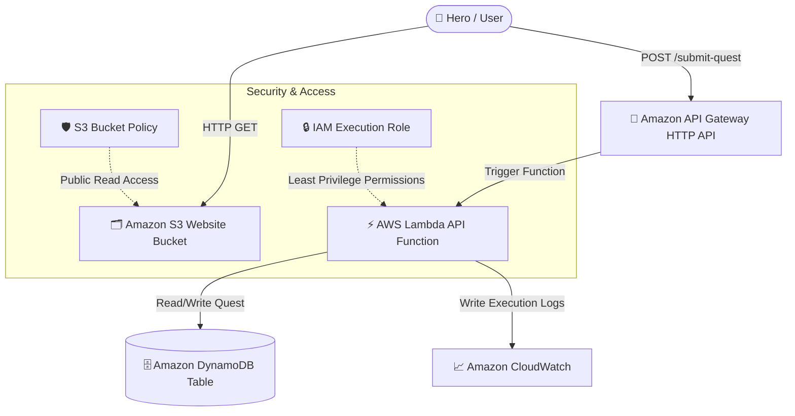

# ⚔ CloudQuest Architecture Documentation

This document describes the system architecture and data flow for the **CloudQuest Serverless Guild Portal**. It covers the serverless AWS components, data flow lifecycle, security controls, and design decisions that enable real-time quest management.


## 🗺 Architecture Overview

CloudQuest is built entirely on serverless infrastructure using AWS. It utilizes a Decoupled Single Page Application (SPA) frontend hosted on **Amazon S3** and a microservice backend powered by **Amazon API Gateway**, **AWS Lambda**, and **Amazon DynamoDB**.




## 🔄 End-to-End Data Flow

When a user submits a quest contract through the Guild Portal, the request goes through the following lifecycle stages:

1. **Submission**:
   - The user fills out the quest form (Hero Moniker, Combat Class, Quest Objective, Threat Level, and Details) and clicks **"Submit Contract"**.
   - An HTTP `POST` request is sent to `https://{api-id}.execute-api.{region}.amazonaws.com/submit-quest` with the request body:
     ```json
     {
       "heroName": "Hritik",
       "heroClass": "Warrior",
       "questType": "Dragon Hunt",
       "dangerLevel": "Extreme",
       "description": "Ancient dragon attacking villages"
     }
     ```

2. **Ingress & Routing**:
   - **Amazon API Gateway** receives the HTTPS request, handles CORS preflight operations, and translates the HTTP payload into a Lambda proxy integration event.

3. **Processing & Logic (AWS Lambda)**:
   - The Lambda function parses the event payload.
   - It performs serverless business logic:
     - Generates a unique, prefixed Quest ID: `QST-[HEX_STRING]` (e.g. `QST-D7F05FE3`).
     - Calculates a **Gold Payout** based on the danger level (e.g., Low = 50g, Extreme = 500g).
     - Assigns a **Guild Rank** (e.g., Novice, Legendary) mapped to the selected danger level.
     - Adds a timestamp (`acceptedAt`) and status (`PENDING`).
   - It saves the formatted contract into **Amazon DynamoDB**.

4. **Persistence**:
   - The record is persisted in DynamoDB.
   - On success, the Lambda function returns a `201 Created` HTTP response to the frontend containing the newly created quest details.

5. **Client Rendering**:
   - The frontend receives the response, plays a victory sound theme, triggers a **canvas particle explosion** of falling gold coins, and stamps the parchment with an animated **Wax Seal** modal containing the confirmed quest contract details.


## 📂 Core Components

### 1. Frontend Client (Amazon S3 Static Website)
- **Tech Stack**: Vanilla HTML5, CSS3 (RPG Fantasy Theme), Vanilla JavaScript.
- **Design & UX Features**:
  - Custom typography using Google Fonts (*Cinzel* for gothic headers and *Cormorant Garamond* for serif parchment body text).
  - Dynamic **Hero Stats Card** representing the player's core stats (Strength, Magic, Agility) which scale dynamically depending on the selected Combat Class.
  - **Live Parchment Scroll** that updates in real-time as the user types, syncing the contract preview dynamically.
  - **Web Audio API Sound Engine** synthesizing custom synth sound effects (hover ticks, selection chirps, submit hums, and success fanfares) without needing external media files.
  - Interactive canvas overlay simulating a rainfall of gold coins upon successful quest acceptance.

### 2. API Gateway (HTTP API V2)
- Provides a lightweight HTTP entrypoint to trigger the backend business logic.
- Configured with open CORS policies to allow cross-origin requests from the S3 bucket website domain.

### 3. Serverless Execution Engine (AWS Lambda)
- Written in **Python 3.x**.
- Packages logic in `lambda/handler.py`.
- Stateless and autoscaling, executing inside the AWS microVM execution context.

### 4. Persistence Layer (Amazon DynamoDB)
- Mapped as a single NoSQL table `cloudquest-quest-requests`.
- Primary Key (Partition Key): `questId` (String).
- Schema-less design storing all quest metadata (Hero name, class, danger level, reward, status, timestamps, etc.).


## 🔒 Security & Access Control

- **S3 Public Read**: The frontend S3 bucket is locked down to block arbitrary ACL writes, but allows public read access for website hosting using an explicit bucket policy (`s3:GetObject` on `*`).
- **IAM Execution Role**: The Lambda function runs with a dedicated execution role. It follows the **principle of least privilege**, granting access ONLY to write logs to CloudWatch (`logs:CreateLogGroup`, `logs:CreateLogStream`, `logs:PutLogEvents`) and read/write to the DynamoDB table (`dynamodb:PutItem`, `dynamodb:GetItem`).
- **Input Validation**: Lambda validates the structure of the incoming quest request body to ensure proper fields are populated before performing operations or saving to the database.
